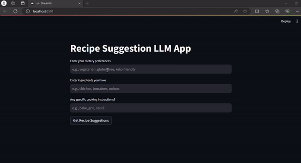

# Recipe Suggestion LLM App

The Recipe Suggestion LLM (Large Language Model) App is a Python application designed to assist users in finding recipes based on their dietary preferences, ingredients, and cooking requirements. The app utilizes an LLM to process natural language queries and retrieve relevant recipes from a provided dataset.

## Overview

The Recipe Suggestion LLM App allows users to input queries related to dietary preferences, ingredients, and cooking instructions. The LLM processes these queries and suggests suitable recipes along with step-by-step cooking instructions based on the provided information.

## Demo
See how this tool works:




This LLM-powered application utilizes user-provided dietary preferences and available ingredients to suggest personalized recipes, delivering step-by-step cooking instructions in real-time.

## Features

- **Recipe Recommendation:** Provide users with suitable recipe suggestions based on their queries.
- **Dietary Preferences:** Cater to various dietary preferences and restrictions in recipe suggestions.
- **Step-by-Step Instructions:** Offer detailed cooking instructions for the suggested recipes.

## How to Run

**Before proceeding**, download the recipe dataset from the [Google Drive](https://drive.google.com/drive/folders/13RdcLZ_CXfrZ-H39jzQgqz_DnC9z2S9B?usp=sharing) link.


### Using Docker

1. Create a `.env` file in the root directory with the following configurations:
    ```bash
    OPENAI_API_TOKEN={OPENAI_API_KEY}
    EMBEDDER_LOCATOR=text-embedding-ada-002
    EMBEDDING_DIMENSION=1536
    MODEL_LOCATOR=gpt-3.5-turbo
    MAX_TOKENS=200
    TEMPERATURE=0.0
    RECIPE_DATASET_LOCAL_PATH={REPLACE_WITH_RECIPE_DATASET_RELATIVE_PATH}
    ```
 Replace the `OPENAI_API_TOKEN` configuration value with your key `{OPENAI_API_KEY}` and replace `RECIPE_DATASET_LOCAL_PATH` with a path where Recipe Dataset folder is located `{REPLACE_WITH_DROPBOX_FOLDER_PATH}`

2. Run the Docker container:
    ```bash
    docker compose up
    ```

### Running from Source

1. Clone the repository:
    ```bash
    git clone https://github.com/your-username/recipe-suggestion-llm-app.git
    cd recipe-suggestion-llm-app
    ```

2. Set up environment variables in a `.env` file:
    ```bash
    OPENAI_API_TOKEN={OPENAI_API_KEY}
    HOST=0.0.0.0
    PORT=8080
    EMBEDDER_LOCATOR=text-embedding-ada-002
    EMBEDDING_DIMENSION=1536
    MODEL_LOCATOR=gpt-3.5-turbo
    MAX_TOKENS=200
    TEMPERATURE=0.0
    RECIPE_DATASET_LOCAL_PATH="../../../mnt/c/Users/abhib/documents"
    ```
    Replace RECIPE_DATASET_LOCAL_PATH with your local Dataset folder path and optionally, you customize other values.

3. Install the required dependencies:
    ```bash
    pip install -r requirements.txt
    ```

4. You start the application by running `main.py`:
    ```bash
    python main.py
    ```

5. Run Streamlit UI
You can run the UI separately by running Streamlit app `streamlit run ui.py` command. It connects to the Pathway's backend API automatically and you will see the UI frontend is running on your browser.

## Usage

1. Access the app through your web browser at `localhost:8080`.
2. Enter queries related to dietary preferences, ingredients, or cooking instructions.
3. View the suggested recipes along with detailed cooking instructions.

## Contributors

- [Abhishek Kumar](https://github.com/abhibarnwal707)

## License

This project is licensed under the [MIT License](LICENSE).
